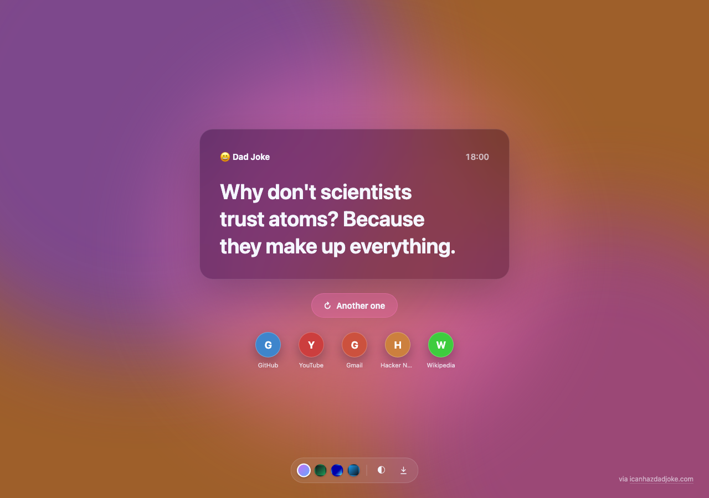
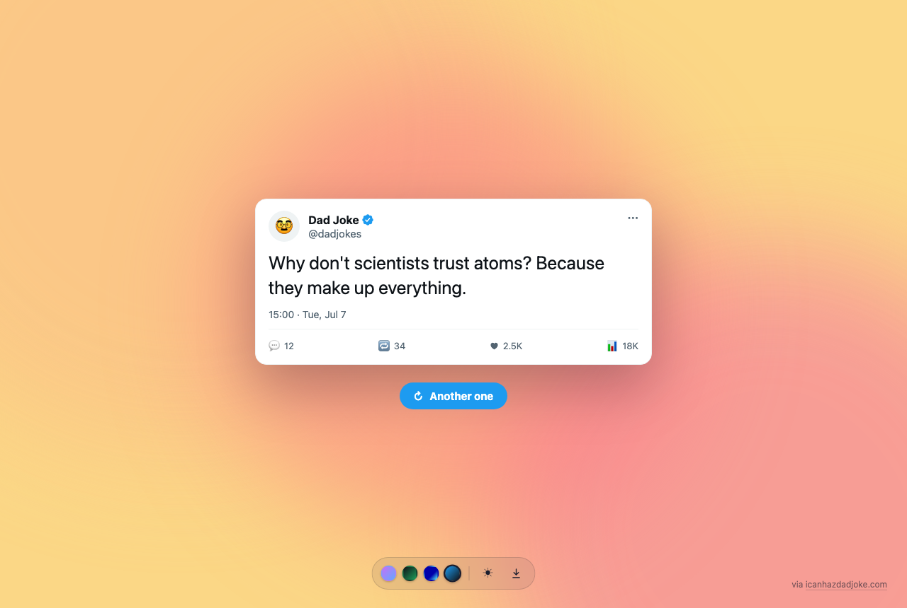
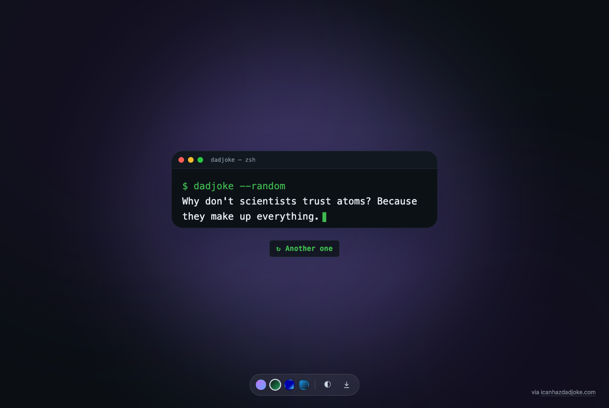
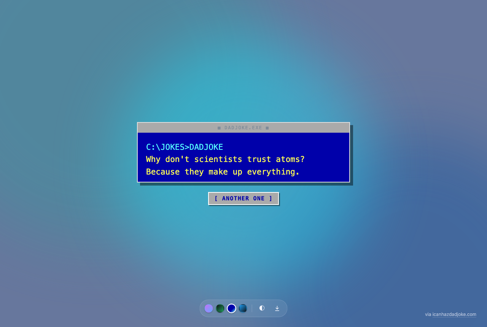
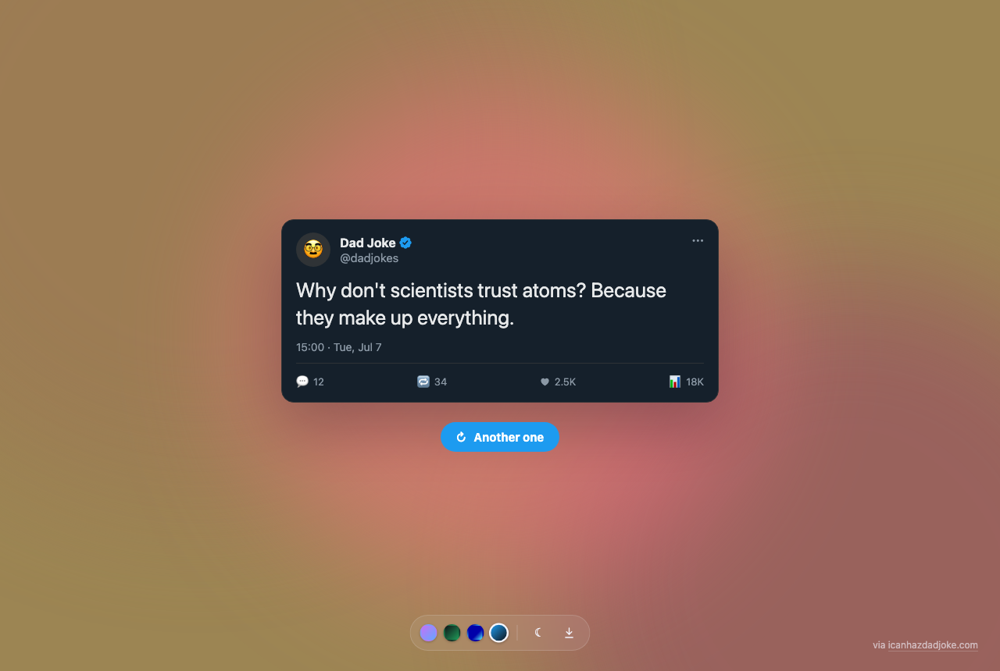

<div align="center">

# 😄 Dad Joke

**A New Tab extension for Chrome, Edge & Firefox that greets every new tab with a fresh dad joke.**

Powered by [icanhazdadjoke.com](https://icanhazdadjoke.com/) · four card themes · a sky that changes with the hour · recent-bookmark shortcuts · on-device translation · one-click image export.

[](LICENSE)
[](https://wxt.dev/)
[](tsconfig.json)
[](PRIVACY.md)




</div>

---

## Contents

- [Features](#features)
- [Themes](#themes)
- [The time-of-day gradient](#the-time-of-day-gradient)
- [Translation](#translation)
- [Download as image](#download-as-image)
- [Privacy & permissions](#privacy--permissions)
- [Install](#install)
- [Project structure](#project-structure)
- [Development](#development)
- [Build & package](#build--package)
- [Release / publish](#release--publish)
- [Roadmap](#roadmap)
- [Contributing](#contributing)
- [License](#license)

## Features

- 🃏 **A fresh dad joke on every new tab**, with an **Another one** button for the next.
- 🎨 **Four card themes** — Basic, Terminal, DOS, and Twitter — switchable from a dock at the bottom.
- 🌗 **Dark mode** — `auto` (follows your OS), `light`, or `dark`.
- 🌅 **Dreamy fluid gradient** that shifts colour with the hour, from midnight indigo to dawn rose to midday sky to dusk magenta.
- 🕒 **Time & date** — a live clock on the Basic card, a timestamp on the Twitter card, both localized.
- 🔖 **Recent bookmarks** — your five latest bookmarks as quick-launch circles under the card, with site favicons (a coloured monogram where none is available).
- 🌍 **Auto-translation** into your browser's language, running **on-device** (Chrome 138+).
- ⬇️ **Download the current card as a PNG**, rendered locally — nothing is uploaded.
- 🔒 **On-device only** — no accounts, no tracking, no data collection; two read-only permissions, no network beyond the joke API.

Every preference — theme, dark-mode setting, and translation toggle — is saved in
`localStorage`, so the extension needs no storage permission. It reads your recent
bookmarks (and their cached favicons) locally to render the shortcuts; nothing
about them ever leaves your device.

## Themes

Every theme presents the same joke as a **card** with its own personality. All
cards share one width, and the **Another one** button sits centred just below the
card (so it stays out of the exported image).

| Theme        | Look                                                                 |
| ------------ | -------------------------------------------------------------------- |
| **Basic**    | Clean frosted card with a brand + live clock on the dreamy gradient  |
| **Terminal** | macOS terminal window — `$ dadjoke --random` with a blinking caret   |
| **DOS**      | Retro MS-DOS blue screen — `C:\JOKES>`, box border, block cursor     |
| **Twitter**  | Presented as a tweet — avatar, verified badge, timestamp, action row |

<div align="center">




</div>

Terminal and DOS use their own opaque cards; the time-of-day gradient shows softly
around them. Basic and Twitter sit directly on it. Twitter follows dark mode with a
proper light/dark card.

## The time-of-day gradient

The background is a smooth function of the clock. Eight colour anchors spaced every
three hours — midnight → deep night → dawn → morning → midday → afternoon → dusk →
evening — are linearly interpolated by the **exact minute**, so 07:45 sits three
quarters of the way from dawn toward morning. Three slowly drifting, blurred blobs
paint the sky, and the foreground ink colour is chosen from the resulting luminance
so text stays legible at every hour and in every mode.

See [`lib/daylight.ts`](lib/daylight.ts).

## Translation

Jokes arrive from the API in English. When your browser is set to another language,
Dad Joke translates the joke (and the small UI labels) into it using Chrome's
built-in **[Translator API](https://developer.chrome.com/docs/ai/translator-api)**
(Chrome 138+). The model runs **on-device** — no network request, no API key, and
no permission.

- A `DE` / `FR` / … chip appears in the switcher; tap it to flip back to the
  original English at any time.
- The first translation of a new language may need a one-time model download, which
  the browser grants on your first click; until then the joke shows in English.
- Where the API isn't available (e.g. Firefox), the joke simply stays in English —
  nothing breaks.

See [`lib/translate.ts`](lib/translate.ts).

## Download as image

The **⬇ button** in the switcher exports the current card as a PNG
(`dad-joke-<theme>.png`). Rendering is done locally with
[`html-to-image`](https://github.com/bubkoo/html-to-image) — the card is drawn to a
canvas in your browser and downloaded directly, so **nothing is uploaded** and no
capture permission is required. The **Another one** button lives outside the card,
so it never appears in the exported image.

## Privacy & permissions

Dad Joke declares just two permissions, both used **entirely on-device**:

| Permission            | Why                                                                              |
| --------------------- | ------------------------------------------------------------------------------- |
| `bookmarks`           | Read your five most recent bookmarks to show them as shortcuts. Never transmitted. |
| `favicon` (Chrome/Edge) | Show each bookmark's icon from the **local** favicon cache — no network request.  |

Everything else needs no permission:

- The joke API returns `Access-Control-Allow-Origin: *`, so the New Tab page fetches
  a joke directly — no host permission.
- Preferences live in `localStorage` — no `storage` permission.
- Translation (built-in Translator API) and PNG export (`html-to-image`) both run
  on-device — no network, no permission.

The only network request is the single joke fetch per new tab. No accounts, no
analytics, no trackers, no data collection — and your bookmarks never leave your
device. Full details in [PRIVACY.md](PRIVACY.md).

## Install

**From the stores:**

- Chrome Web Store — [Dad Joke](https://chrome.google.com/webstore/detail/dad-joke/igljegfflaiflopomehaccaohfijodei)
- Firefox Add-ons — [Dad Joke](https://addons.mozilla.org/en-US/firefox/addon/dad-joke/)

**From source (unpacked):**

```bash
npm install
npm run build            # Chrome/Edge  → .output/chrome-mv3
npm run build:firefox    # Firefox      → .output/firefox-mv2
```

- **Chrome/Edge:** open `chrome://extensions`, enable **Developer mode**, click
  **Load unpacked**, and select `.output/chrome-mv3`.
- **Firefox:** open `about:debugging` → **This Firefox** → **Load Temporary
  Add-on**, and pick any file inside `.output/firefox-mv2`.

## Project structure

Version 2 is built with [WXT](https://wxt.dev/) and TypeScript. WXT generates a
per-browser manifest from `wxt.config.ts` plus the files in `entrypoints/`, and
handles building, zipping, and store submission from a single codebase. The New Tab
page is auto-wired as `chrome_url_overrides.newtab`.

```
entrypoints/
  newtab/
    index.html         # card markup (chrome for each theme lives here)
    main.ts            # wiring: fetch, theme/mode/lang switcher, clock, download
    style.css          # all four themes + the gradient + switcher
lib/
  joke.ts              # fetch a random joke from the API
  config.ts            # API endpoint + user agent
  daylight.ts          # time-of-day gradient palette engine
  themes.ts            # the four theme definitions
  translate.ts         # on-device translation (built-in Translator API)
  bookmarks.ts         # recent bookmarks + local favicons
  prefs.ts             # theme + dark-mode + translate prefs (localStorage)
public/icon/           # 16 / 32 / 48 / 128 px extension icons
screenshots/           # theme screenshots used in this README
wxt.config.ts          # manifest config
.github/workflows/     # CI (build) + Release (zip & publish)
```

**Runtime dependency:** [`html-to-image`](https://github.com/bubkoo/html-to-image)
(card → PNG export). Everything else is dev-only (`wxt`, `typescript`).

## Development

Requires **Node 22+**.

```bash
npm install            # installs deps and runs `wxt prepare`
npm run dev            # live-reload dev build for Chrome
npm run dev:firefox    # live-reload dev build for Firefox
npm run compile        # type-check only (tsc --noEmit)
```

## Build & package

```bash
npm run build          # production build (Chrome, .output/chrome-mv3)
npm run build:firefox  # production build (Firefox, .output/firefox-mv2)

npm run zip            # Chrome store zip
npm run zip:firefox    # Firefox store zip + sources zip
npm run zip:edge       # Edge store zip
npm run package        # all three at once
```

Zips land in `.output/`.

## Release / publish

Publishing is automated by [`.github/workflows/release.yml`](.github/workflows/release.yml).
Bump `version` in `package.json`, then push a matching tag:

```bash
# e.g. for version 2.0.0
git tag v2.0.0
git push origin v2.0.0
```

The workflow verifies the tag matches `package.json`, type-checks, zips all three
targets, uploads them as build artifacts, and runs `wxt submit` for any store whose
secrets are configured. Steps for stores without secrets are skipped, so
Chrome-only or Firefox-only releases work out of the box.

| Store   | Required repository secrets                                                               |
| ------- | ---------------------------------------------------------------------------------------- |
| Chrome  | `CHROME_EXTENSION_ID`, `CHROME_CLIENT_ID`, `CHROME_CLIENT_SECRET`, `CHROME_REFRESH_TOKEN` |
| Firefox | `FIREFOX_EXTENSION_ID`, `FIREFOX_JWT_ISSUER`, `FIREFOX_JWT_SECRET`                        |
| Edge    | `EDGE_PRODUCT_ID`, `EDGE_CLIENT_ID`, `EDGE_API_KEY`                                       |

Continuous integration ([`.github/workflows/ci.yml`](.github/workflows/ci.yml))
type-checks and builds both browsers on every push and pull request.

> **Firefox note:** set your own `browser_specific_settings.gecko.id` in
> `wxt.config.ts` before publishing to AMO.

## Roadmap

- [x] Dad joke preview + **Another one**
- [x] Four card themes (Basic, Terminal, DOS, Twitter)
- [x] Dark mode (auto / light / dark)
- [x] Time-of-day fluid gradient
- [x] Time & date view
- [x] On-device auto-translation
- [x] Download card as PNG
- [x] Recent-bookmark quick-launch shortcuts
- [ ] Random background
- [ ] More themes

## Contributing

Issues and pull requests are welcome. Please keep the permission footprint
**minimal** (and on-device — no new network calls) and run `npm run compile`
before opening a PR. Adding a theme is mostly a new entry in `lib/themes.ts` plus
a `data-theme` block in `entrypoints/newtab/style.css`.

## License

[AGPL-3.0-or-later](LICENSE) © [Amir Douzandeh](https://github.com/amirzenoozi).

Jokes courtesy of [icanhazdadjoke.com](https://icanhazdadjoke.com/).
